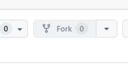
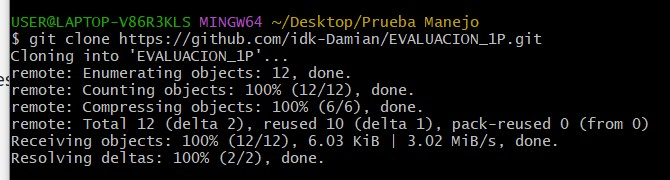
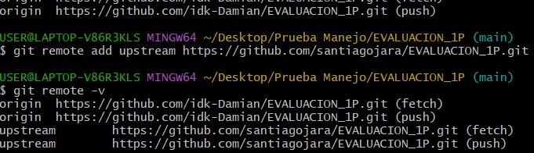
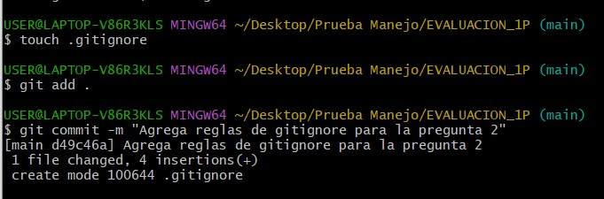
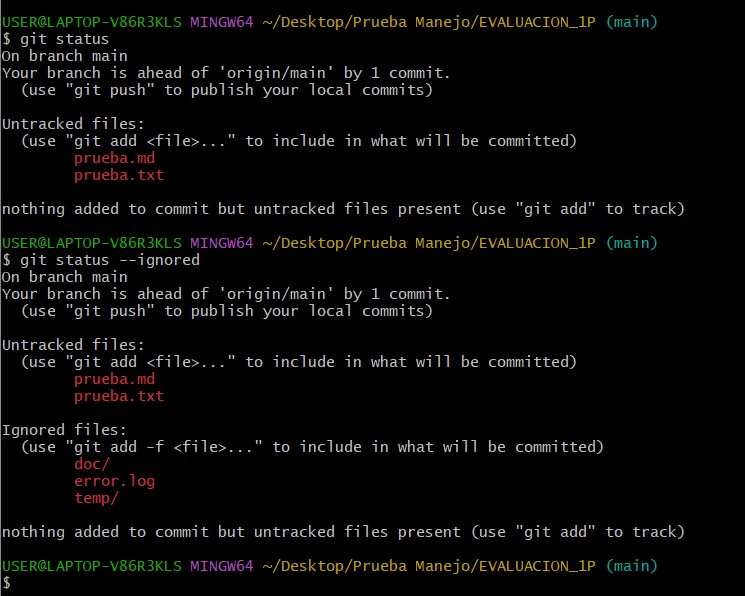
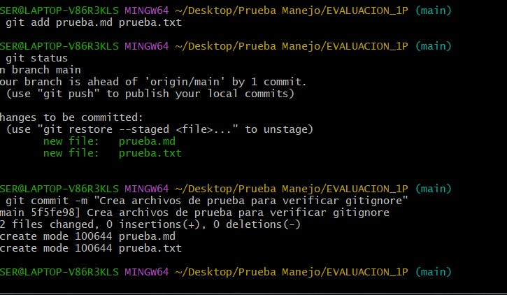
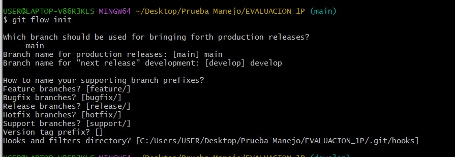
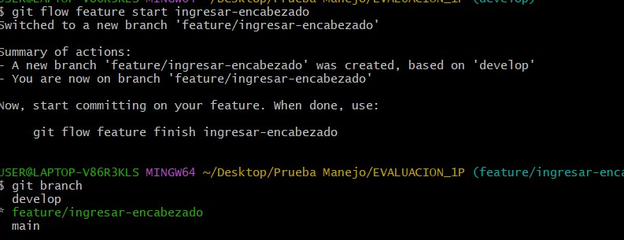
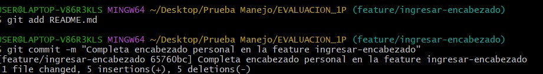
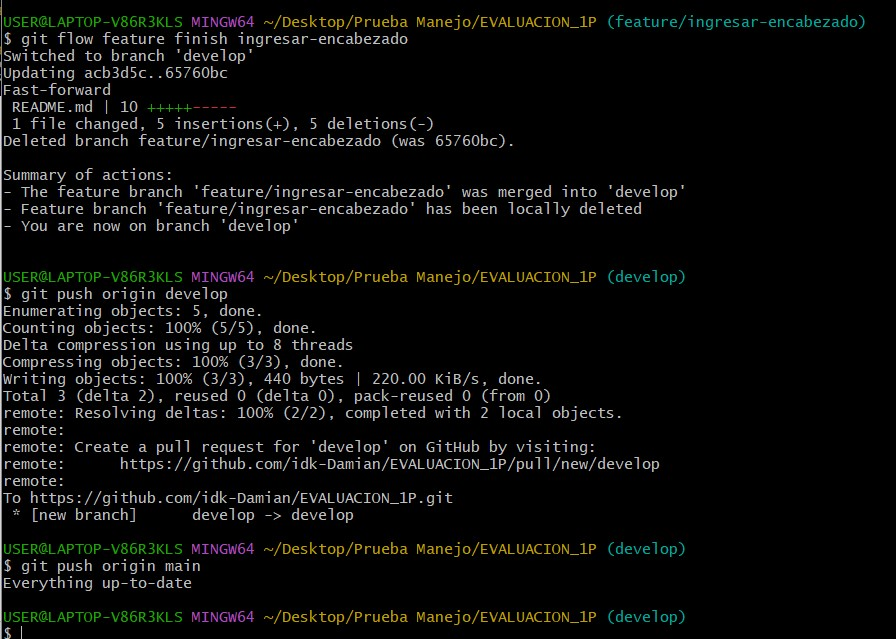

# Universidad UNIVERSIDAD TECNICA DE AMBATO
## Facultad de FISEI  
### Carrera de SOFTWARE 

**Asignatura:** Manejo y Configuración de Software  
**Nombre del Estudiante:** Pablo Lozada
**Fecha:** 08/04/2026

---

# Evaluación Práctica de Git y GitHub

## Instrucciones Generales

- Cada pregunta debe ser respondida directamente en este archivo **(README.md)** debajo del enunciado correspondiente. 
- Es importante que se coloque capturas de pantalla como evidencia de la parte práctica. Se recomienda crear una carpeta `images/` para almacenar las capturas de pantalla.
- Cada respuesta debe ir acompañada de uno o más **commits**, según se indique en cada pregunta.
- Cuando se indique, deberán realizarse acciones prácticas dentro del repositorio (como creación de archivos, ramas, resolución de conflictos, etc.).
- Cada pregunta debe estar **etiquetada con un tag**, únicamente en el commit final correspondiente, con el formato: `"Pregunta 1"`, `"Pregunta 2"`, etc.

---

## Pregunta 1 (1 punto)

**Explicar la diferencia entre los siguientes conceptos/comandos en Git y GitHub:**

- `git clone`  
- `fork`  
- `git pull`

### Parte práctica:

- Realizar un **fork** de este repositorio en la cuenta personal de GitHub del estudiante.
- Luego, realizar un **clone** del fork en el equipo local.
- En este README, describir el proceso seguido:
  - ¿Cómo se realizó el fork?
  - ¿Cómo se realizó el clone del fork?
  - ¿Cómo se verificó que se estaba trabajando sobre el fork y no sobre el repositorio original?
- Realizar en la rama `main` todo lo que corresponde a esta pregunta.

**📝 Respuesta:**

Se entiende por fork a la copia de un repositorio dentro de la cuenta personal de GitHub. Esto permite trabajar sobre una versión propia del proyecto sin modificar directamente el repositorio original.

El comando git clone se utiliza para descargar una copia del repositorio remoto al equipo local, creando una carpeta con todos los archivos e historial de cambios.

El comando git pull sirve para traer y fusionar al repositorio local los cambios más recientes que existen en el repositorio remoto.

Proceso realizado:

1. Primero se realizó el fork del repositorio original desde GitHub, usando la opción "Fork" en la parte superior derecha de la página del repositorio.
2. Luego se ingresó al fork creado en la cuenta personal y se copió el enlace desde el botón "Code".
3. Después, en la terminal, se ejecutó el siguiente comando para clonar el fork en el equipo local:

   git clone https://github.com/idk-Damian/EVALUACION_1P.git

4. Se ingresó a la carpeta del proyecto con:

   cd EVALUACION_1P

5. Para verificar que se estaba trabajando sobre el fork y no sobre el repositorio original, se ejecutó:

   git remote -v

   En la salida se observó que el remote origin apuntaba al repositorio personal del estudiante.

6. Adicionalmente, se agregó el repositorio original como upstream con el comando:

   git remote add upstream https://github.com/santiagojara/EVALUACION_1P.git

Con esto se confirmó que:
- origin corresponde al fork personal
- upstream corresponde al repositorio original

---
EVIDENCIAS

## Pregunta 2 (1 punto)

**Configurar un archivo `.gitignore` para que ignore:**

- Todos los archivos con extensión `.log`.
- Una carpeta llamada `temp/`.
- Todos los archivos `.md` y `.txt`de la carpeta `doc/`. (Probar agregando un archivo `prueba.md` y un archivo `prueba.txt` dentro de la carpeta y fuera de la carpeta.)

### Requisitos:

1. Realizar un **primer commit** que incluya únicamente el archivo `.gitignore` con las reglas de exclusión definidas.
2. Realizar un **segundo commit** que incluya las creación de los archivos de prueba.
2. Realizar un **tercer commit** donde se explique en este README la función del archivo `.gitignore` y se muestre evidencia de que los archivos y carpetas indicadas no están siendo rastreadas por Git.

**Importante:**  
- Solo el **tercer commit** debe llevar el **tag `"Pregunta 2"`**.

**📝 Respuesta:**

El archivo `.gitignore` se utiliza para indicarle a Git qué archivos o carpetas no deben ser rastreados dentro del repositorio. Esto es útil para evitar subir archivos temporales, registros, archivos generados automáticamente o elementos que no forman parte del desarrollo principal del proyecto.

Para esta pregunta se configuró el archivo `.gitignore` con las siguientes reglas:

- `*.log` para ignorar todos los archivos con extensión `.log`
- `temp/` para ignorar la carpeta `temp/`
- `doc/*.md` para ignorar los archivos Markdown dentro de `doc/`
- `doc/*.txt` para ignorar los archivos de texto dentro de `doc/`

Después se crearon archivos de prueba dentro y fuera de la carpeta `doc/` para comprobar el funcionamiento.

Resultados observados:

- El archivo `error.log` fue ignorado correctamente.
- La carpeta `temp/` también fue ignorada.
- Los archivos `doc/prueba.md` y `doc/prueba.txt` no fueron rastreados por Git.
- En cambio, los archivos `prueba.md` y `prueba.txt` creados fuera de la carpeta `doc/` sí fueron detectados por Git, porque la regla solo aplica a los archivos `.md` y `.txt` ubicados dentro de `doc/`.

Esto permitió comprobar que las reglas del `.gitignore` funcionan de manera específica según la ruta y el tipo de archivo definidos.
---

## Pregunta 3 (2 puntos)

**Utilizar Git Flow para desarrollar una nueva funcionalidad llamada `ingresar-encabezado`.**

### Requisitos:

- Inicializar el repositorio con Git Flow, utilizando las ramas por defecto: `main` y `develop`.
- Crear una rama de tipo `feature` con el nombre `ingresar-encabezado`.
- En dicha rama, **completar con los datos personales del estudiante** el encabezado que ya se encuentra al inicio de este archivo `README.md`.
- Realizar al menos un commit durante el desarrollo.
- Finalizar el hotfix siguiendo el flujo de trabajo establecido por Git Flow.

### En la sección de respuesta, se debe incluir:

- Los **comandos exactos** utilizados desde la inicialización de Git Flow hasta el cierre de la rama.
- Una descripción del **proceso seguido**, indicando el propósito de cada paso.
- Una reflexión sobre las **ventajas de aplicar Git Flow**, especialmente en contextos colaborativos o proyectos de larga duración.

**Importante:**

- Deben realizarse varios commits durante esta pregunta.
- **Solo el commit final** debe llevar el **tag `"Pregunta 3"`**.
- El flujo debe respetar la estructura de Git Flow con las ramas `develop` y `main`.

**📝 Respuesta:**

Para esta pregunta se utilizó Git Flow como modelo de organización de ramas dentro del repositorio.

Comandos utilizados:

1. Inicialización de Git Flow:
   git flow init

2. Creación de la rama feature:
   git flow feature start ingresar-encabezado

3. Registro de cambios realizados en el encabezado:
   git add README.md
   git commit -m "Completa encabezado personal en la feature ingresar-encabezado"

4. Cierre de la rama feature:
   git flow feature finish ingresar-encabezado

5. Envío de cambios al repositorio remoto:
   git push origin develop

Proceso realizado:

Primero se inicializó Git Flow en el repositorio, configurando las ramas principales `main` y `develop`. Después se creó una rama de tipo feature llamada `ingresar-encabezado`, destinada a trabajar de forma aislada en la edición del encabezado del archivo README.md.

Dentro de esta rama se completaron los datos personales del estudiante y se realizaron los commits correspondientes. Una vez terminados los cambios, se finalizó la feature usando el flujo de Git Flow, lo que permitió integrar los cambios a la rama `develop` y eliminar la rama de trabajo temporal.

Ventajas de Git Flow:

Git Flow permite organizar mejor el trabajo cuando existen varias tareas o integrantes en un proyecto. Ayuda a separar el desarrollo de nuevas funcionalidades, correcciones y versiones estables, evitando que todos trabajen directamente sobre la rama principal. En proyectos colaborativos o de larga duración, este modelo facilita el control de cambios, mejora el orden del trabajo y reduce el riesgo de errores al momento de integrar avances.

---

## Pregunta 4 (2 puntos)

**Trabajo con Issues y Pull Requests**

### Parte teórica:

- ¿Qué es un Pull Request y cuál es su función dentro de un flujo de trabajo colaborativo con Git y GitHub?
- ¿Por qué es importante revisar un Pull Request antes de fusionarlo con la rama principal?
- ¿Qué tipo de observaciones o validaciones se suelen realizar durante la revisión de un Pull Request?

### Parte práctica:

- Trabajar en la rama `develop`, ya existente desde la configuración de Git Flow.
- Realizar los cambios necesarios en este archivo `README.md` para responder las preguntas.
- Realizar un **commit** con los cambios de la primera pregunta y subirlo a la rama `develop` del repositorio remoto.
- Crear un **pull request** desde `develop` hacia `main` en GitHub, con el nombre `"Pregunta 4 - Apellido Nombre"`.
- Crear comentarios solicitando: 1. que se agregue la respuesta de la segunda pregunta y luego agregando la respuesta con el respectivo commit; y 2. el mismo procedimiento para la tercera pregunta.
- **Aprobar** el pull request para que se haga el merge respectivo hacia `main`.

### En la sección de respuesta, se debe incluir:

- Un resumen del procedimiento realizado con las respectivas preguntas y capturas.
- El número y enlace al pull request.

**📝 Respuesta:**

Un Pull Request es una solicitud para integrar cambios de una rama hacia otra dentro de un repositorio. Su función principal en un flujo de trabajo colaborativo es permitir que los cambios sean revisados antes de ser fusionados, facilitando el control de calidad y la coordinación entre los integrantes del proyecto.

Es importante revisar un Pull Request antes de fusionarlo con la rama principal porque así se pueden detectar errores, cambios incompletos, conflictos, malas prácticas o información faltante. También permite confirmar que los cambios cumplen con el objetivo planteado y no afectan negativamente al resto del proyecto.

Durante la revisión de un Pull Request se suelen validar aspectos como:
- que el código o contenido esté correcto
- que los cambios correspondan realmente a lo solicitado
- que no existan conflictos con otras ramas
- que la redacción o estructura sea adecuada
- que las capturas o evidencias estén completas si la actividad lo requiere

Procedimiento realizado:

Se trabajó en la rama `develop`, donde se realizaron los cambios necesarios en el archivo README.md para responder la parte teórica de la pregunta. Luego se hizo un commit y se subió la rama al repositorio remoto. Después se creó un Pull Request desde `develop` hacia `main` con el nombre solicitado.

Dentro del Pull Request se agregaron comentarios indicando que faltaba incorporar la respuesta de la segunda pregunta, y posteriormente se añadió mediante un nuevo commit. Después se repitió el mismo procedimiento para la tercera pregunta. Finalmente, el Pull Request fue aprobado y fusionado hacia la rama `main`.

Número y enlace del Pull Request:
gh pr checkout 159

---

## Pregunta 5 (2 puntos)

**Resolver conflictos entre ramas y realizar un Pull Request**

### Requisitos:

- Crear dos ramas llamadas `ramaA` y `ramaB`, ambas a partir de la rama `develop`.
- En `ramaA`, crear un archivo llamado `archivoA.txt` con el contenido:  
  `Contenido A`
- En `ramaB`, crear un archivo con el mismo nombre (`archivoA.txt`), pero con el contenido:  
  `Contenido B`
- Intentar fusionar `ramaB` sobre `ramaA`, lo cual debe generar un conflicto.
- Resolver el conflicto combinando ambos contenidos.
- Realizar el merge de `ramaA` hacia `develop`.
- Crear un **pull request** desde `develop` hacia `main`.
- Una vez completado lo anterior, eliminar las ramas `ramaA` y `ramaB`.

### En la sección de respuesta, se debe incluir:

- El procedimiento completo:
  - Cómo se crearon las ramas.
  - Cómo se generó y resolvió el conflicto.
  - Cómo se realizó el merge hacia `develop`.
  - Cómo se eliminaron las ramas al finalizar.
- El enlace al pull request.
- Una breve explicación de qué es un conflicto en Git y por qué ocurrió en este caso.

**📝 Respuesta:**

<!-- Escribe aquí tu respuesta completa a la Pregunta 5 -->

---

## Pregunta 6 (2 puntos)

**Realizar limpieza, explicar versionamiento semántico y enviar cambios al repositorio original**

### Requisitos:

- Trabajar en la rama `develop` del fork del repositorio.
- Eliminar los archivos `archivoA.txt` y `archivoB.txt` creados en preguntas anteriores.
- Realizar un merge desde `develop` hacia `main` en el repositorio local.
- Enviar los cambios de la rama `main` local a la rama `develop` del repositorio remoto (fork). Recuerde incluir todos los tags creados (6 tags).
- Finalmente, crear un **pull request** desde la rama `develop` del fork hacia la rama `main` del repositorio original (del cual se realizó el fork en la Pregunta 1). El titulo del pull request debe ser `"NOMBRE APELLIDOS"`, en la descripción colocar el link de su repositorio de GitHub.

### En la sección de respuesta, se debe incluir:

- Una explicación del proceso realizado paso a paso.
- Una explicación del **versionamiento semántico**, indicando:
  - En qué consiste.
  - Sus tres componentes (MAJOR, MINOR, PATCH).
- Si hace falta agregar alguna evidencia adicional, agregue un tag adicional que sea `Version Final`.

**📝 Respuesta:**

<!-- Escribe aquí tu respuesta completa a la Pregunta 6 -->
